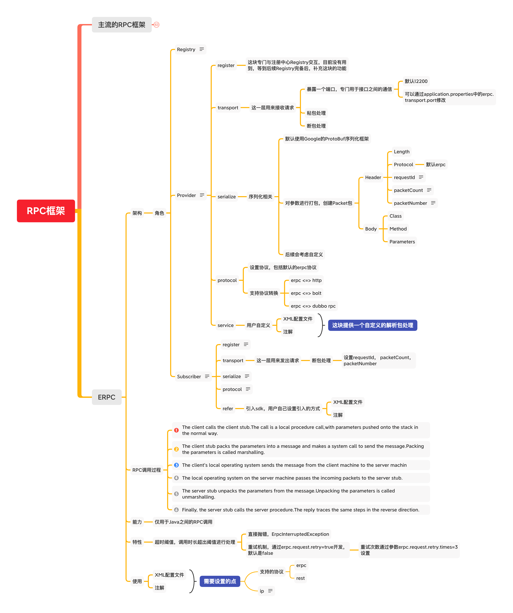

# egg-rpc
## 一个rpc的简单调用协议, 目前仅设计支持以stub形式远程调用功能，后续会提供egg系列配套的注册中心、路由转发功能，以完成完整RPC框架的搭建
### Email: <u>adanli@126.com</u> 欢迎交流  

## ERPC

### 功能规划图

### 软件架构分层
- register 注册层，负责与Registry注册中心之间的通信  
- transport 通信层，负责erpc的客户端和服务端之间的通信
- serialize 序列化层，负责io通信间的对象序列化, 对于包的封装会在这一层进行处理  
- protocol 协议层，实现了tcp协议的一些规定, , 对于数据流的粘包和拆包处理会在这一层里实现
    - tcp实现的规定
        1. 数据分片: 根据默认的数据片大小，对数据流进行切分
        2. 到达确认：接收端收到分片数据时，根据分片数据的序号向服务端发送一个确认
        3. 超时重发：发送端在发送分片时，会启动一个定时器，如果定时器超时的时候仍然没有收到接收端的确认回执，会自动重发这个数据分片
        4. 滑动窗口：接收端只允许接收小于缓冲区容量大小的数据
        5. 失序处理：接收端收到发送端的分片数据的序号可能与发送时的不一致
        6. 重复处理：当重复收到同一个分片数据时，接收端应当丢弃重复的数据
        7. 数据校验：接收端收到数据时，应该校验实际收到的数据与它首部里的数据和是否一致，如果不一致，接收端应当丢弃这个数据包并不触发确认机制，由发送端重新发送数据包  

### RPC调用过程

- The client calls the client stub.The call is a local procedure call,with parameters pushed onto the stack in the normal way.
- The client stub packs the parameters into a message and makes a system call to send the message.Packing the parameters is called marshalling.
- The client's local operating system sends the message from the client machine to the server machin
- The local operating system on the server machine passes the incoming packets to the server stub.
- The server stub unpacks the parameters from the message.Unpacking the parameters is called unmarshalling.
- Finally, the server stub calls the server procedure.The reply traces the same steps in the reverse direction.

### 能力

- 仅用于Java之间的RPC调用

### 特性

- 超时阈值，调用时长超出阈值进行处理

	- 直接抛错，ErpcInterruptedException
	- 重试机制，通过erpc.request.retry=true开发，默认是false

		- 重试次数通过参数erpc.request.retry.times=3设置

### 使用

- XML配置文件
- 注解

## 使用到的开源工具包
- junit: 4.13
- slf4j: 1.7.30
- slf4j-simple: 1.7.30
-jackson-databind: 2.11.3
-jackson-core: 2.11.3
-jackson-annotations: 2.11.3

## UML图
### register  
- 略  
### transport  

### serialize  

### protocol  

### 备注
- 数据包和数据分片的关系
- 需要让被远程调用的接口使用动态代理实现远程调用